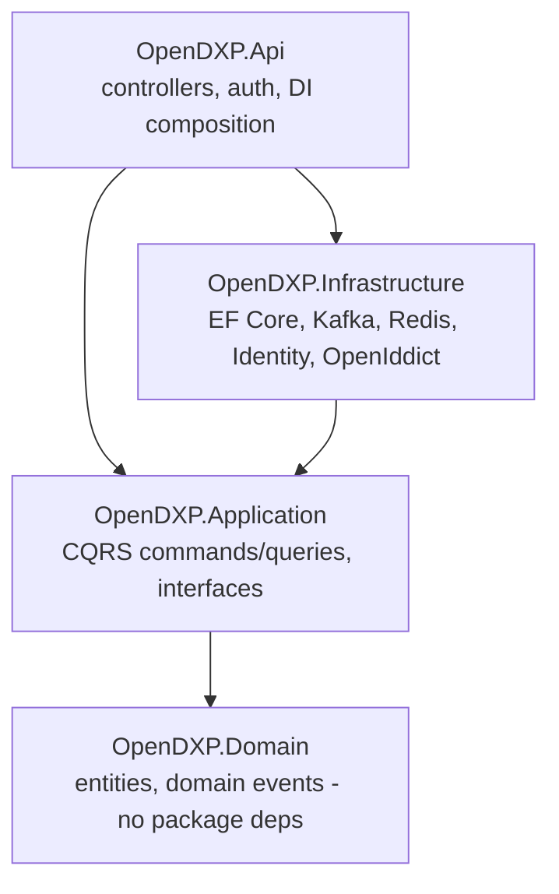
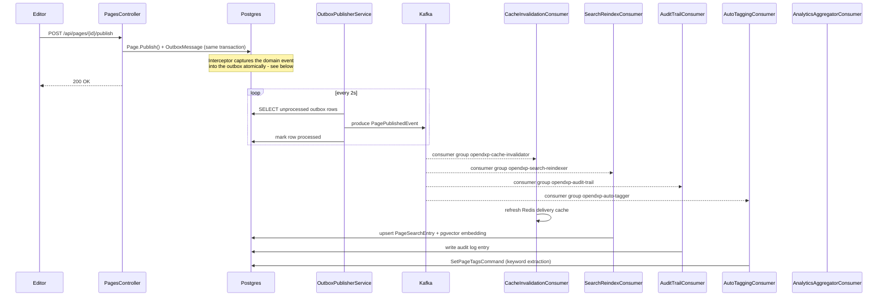
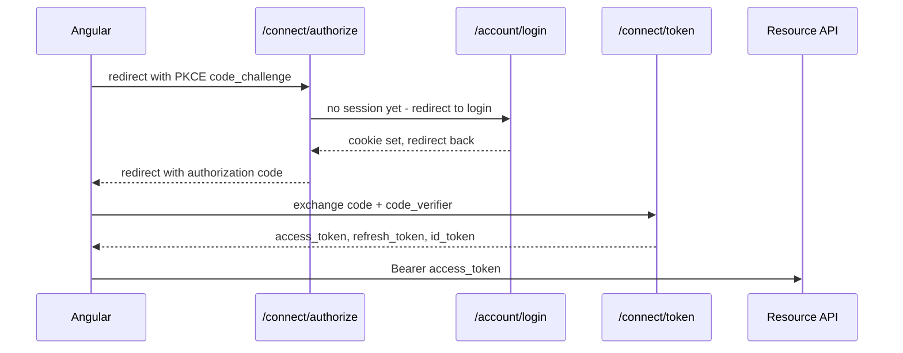

# OpenDXP Architecture

This document explains how the system fits together and why it's built the way it is. For "what's
built so far," see the phase checklist in [README.md](README.md).

## Layers

Clean Architecture, dependencies point inward only:

`Domain` has zero NuGet dependencies beyond the BCL - not even the `Pgvector` package that
`Infrastructure` uses for the `related pages` query (see the pgvector section below for why that
mattered in practice). `Application` defines interfaces (`IPageRepository`, `IEmbeddingService`,
`IAuditLogService`, ...); `Infrastructure` implements them. Controllers depend on `Application`
through `MediatR`, never on `Infrastructure` directly.

## Content lifecycle: draft → publish → event fan-out

The single event that drives most of the system's interesting behavior is `PagePublishedEvent`.

Five independent consumer groups read the same topic and don't know about each other - that's the
actual point of the pattern. Adding a sixth reaction to "a page was published" never touches the
publish code path.

### The transactional outbox, and why it exists

The naive approach - publish to Kafka directly inside `PublishPageCommandHandler` - has a real
failure mode: if the process crashes after the database commit but before the Kafka send, the
event is silently lost and every downstream consumer (cache, search, audit, tags) permanently
disagrees with reality. Reversing the order (Kafka first, then DB) just moves the same problem to
the other side.

The fix: `DomainEventsToOutboxInterceptor` runs inside EF Core's `SavingChangesAsync`, so the
`OutboxMessage` row is written in the *same database transaction* as the `Page` update. Either
both commit or neither does. `OutboxPublisherService` then drains unprocessed rows independently,
on its own schedule - a crash here just delays delivery, it never loses or fakes an event.

## Auth: OpenID Connect, not a bearer-token shortcut

This is the full authorization code + PKCE flow (OpenIddict as the server, ASP.NET Core Identity
as the user store), not resource-owner-password or a hand-rolled JWT issuer. Two authorization
layers stack on top of authentication:

1. **Role-based** (`[Authorize(Roles = "Editor,Admin")]`) - coarse gate on the action.
2. **Resource-based** (`PageOwnershipAuthorizationHandler`) - Editors can only mutate pages they
   own; Admins bypass ownership entirely. This is genuine ASP.NET Core resource-based
   authorization (`IAuthorizationService.AuthorizeAsync(user, resource, policy)`), not another
   role check - it inspects the loaded `Page` itself.

Access tokens are short-lived (15 min); refresh tokens rotate on every use (the old one is marked
`redeemed` in `OpenIddictTokens`, confirmed by direct DB inspection during testing).

## Personalization & experimentation

`PersonalizationEngine` (pure function, no I/O - trivially unit tested) decides what a visitor
sees:

1. Filter `PageVariant`s to those matching the visitor's segment (or untargeted ones).
2. If none of the matches carry a traffic split, the lowest-`Priority` one wins outright.
3. If any do, bucket the visitor via `SHA256(pageId:visitorId) % 100` - stable per visitor, so
   the same person always lands in the same bucket rather than a fresh coin flip every request.
4. Leftover traffic (splits that don't sum to 100) falls through to the default/published content.

Every delivery fires a `VariantServedEvent` directly to Kafka - not through the outbox, since an
occasionally-dropped impression is an acceptable trade-off for not adding write-path latency to
every page view. `AnalyticsAggregatorConsumer` rolls these into `VariantAnalytics` counters.

## Search: real pgvector, honest about the embeddings

`GET /api/search/related/{pageId}` runs a genuine Postgres `vector` column and `<=>` cosine
distance query - not a re-implementation in C#. The embeddings themselves are a deliberate
placeholder: `HashingEmbeddingService` buckets words via SHA256 into a 128-dimension vector and
L2-normalizes it (the "hashing trick," a real technique with no external dependency), rather than
calling an LLM embedding API. `IEmbeddingService` is the seam - swapping in OpenAI or Voyage AI
later is a new implementation of one interface, not a rewrite of the query.

Two implementation details worth calling out because they cost real debugging time:

- **The pgvector EF Core plugin needs EF Core 9**, which conflicts with this solution's EF Core 8
  stack (ASP.NET Core Identity, OpenIddict). `PageSearchEntry.Embedding` is deliberately excluded
  from the EF model (`builder.Ignore(...)`) and managed via raw `NpgsqlCommand` instead - Npgsql's
  own vector type handling (`UseVector()` on the `NpgsqlDataSource`) works fine at that level.
- **Reads need `GetFieldValue<Vector>()`, not `ExecuteScalarAsync()`+cast.** Npgsql's newer
  type-info pipeline can't infer a plugin type like `Vector` when asked for a generic `object`;
  asking for the type explicitly resolves it.

## Observability

OpenTelemetry traces (Jaeger, OTLP) and metrics (`/metrics`, Prometheus format) cover both
framework-level instrumentation (ASP.NET Core, HttpClient, Npgsql, .NET runtime) and domain-level
signals via `OpenDxpTelemetry` - a plain `ActivitySource`/`Meter` pair using only BCL
`System.Diagnostics` types, so `Application` and `Infrastructure` never take a dependency on the
OpenTelemetry SDK itself; only the `Api` host wires an actual exporter. Publishing a page produces
a `PublishPage` span nested in the HTTP request trace, and each Kafka consumer group emits its own
consume span plus processed/failed counters - so a stalled consumer or a spike in failures is
visible per group, not just as an aggregate "something's wrong."

## Kubernetes

`infra/helm/opendxp` deploys the full stack - API (with an HPA), Admin, a Postgres StatefulSet with
a PVC, Redis, Redpanda - and unlike the Azure path, it's actually been installed on a real cluster
(local minikube) and exercised end to end, not just statically validated. Doing so surfaced two
bugs that reading the YAML wouldn't have caught: Redpanda tried to *bind* to its own Kubernetes
Service's ClusterIP (which isn't a real interface inside the pod - that address belongs only on
the *advertise* setting other clients use to reach it, a different concern from what the process
binds locally), and every request 400'd under `ASPNETCORE_ENVIRONMENT=Production` because nothing
was terminating TLS in front of the cluster - fixed by trusting `X-Forwarded-Proto` from the
ingress via ASP.NET Core's `ForwardedHeaders` middleware, confirmed by testing the same request
with and without that header.

## What's deliberately not here yet

- **MFA and multi-tenant claims** (Phase 2) - not needed with a single admin team; the auth
  architecture (OIDC + policy-based authorization) extends to both without a redesign.
- **LLM content assistant and real embeddings** (Phase 5) - both need a paid API key. The seams
  (`IEmbeddingService`, an equivalent interface for content generation) are already in place.
- **A real cloud deployment.** The Kubernetes path works on a real (local) cluster; AKS
  specifically hasn't been tried (ingress class, storage class, and a real secret store all likely
  need adjustment). The Azure Container Apps path (`infra/main.bicep`) is validated locally only -
  actually running it needs real Azure credentials and explicit approval to spend money, which is
  a deliberate stopping point, not an oversight.
